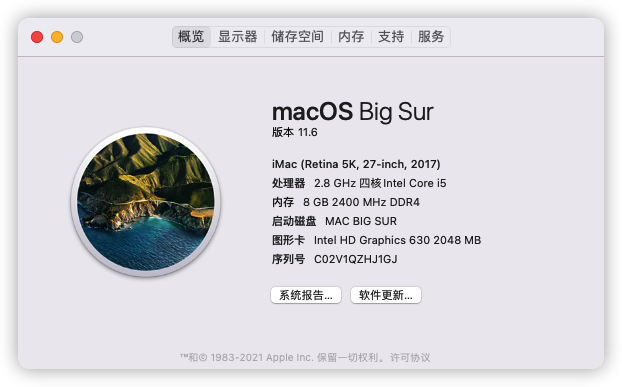
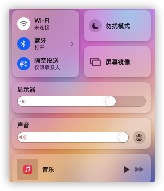
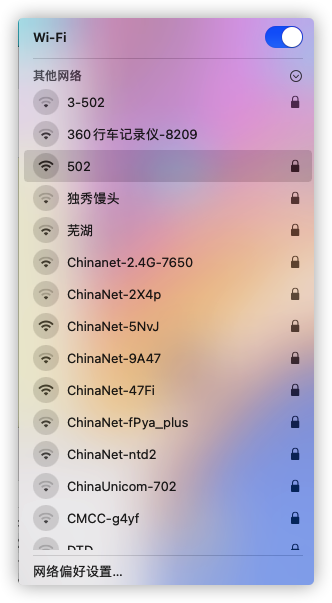
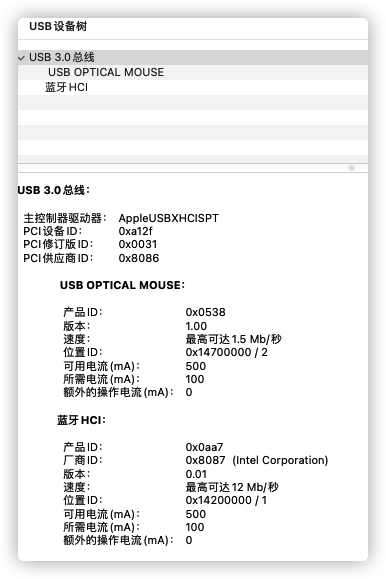
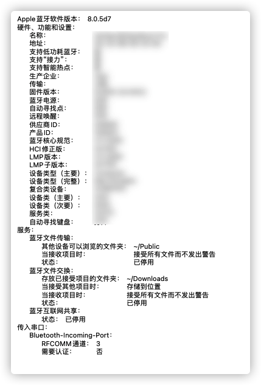
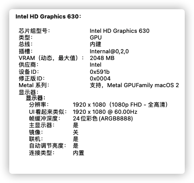

## 神舟Z7M-KP7GT的OC-EFI

本配置文件为神舟Z7M-KP7GT的OC-EFI引导文件，基于**黑果小兵**的EFI进行完善，系统镜像可前往[**黑果小兵的部落**下载](https://blog.daliansky.net/) 。

目前系统为Win11和Big Sur(11.6)双系统，有点小卡顿，基本上正常运行，后续再一点点完善！

### **已支持：**

- Intel 630 核显 1536M

  亮度快捷键需要在 “ 系统偏好 - 键盘 -快捷键 -显示器 ” 修改为 F8 & F9

- Wi-Fi

- USB3.0（速度待完善）

- 蓝牙（蓝牙耳机可以正常使用，手机链接秒断）

- 触摸板（部分手势可识别：音量调节）

- 睡眠可唤醒

- 原生电池

### **待完善：**

- 摄像头无法识别
- 蓝牙可向手机传送文件，但是不能反向传输

### **图片展示：**

**关于系统：**

**快捷开关：**

**Wi-FI：**

**USB: **

**蓝牙：**

[蓝牙参数](img/蓝牙.png)

**显示器：**

**感谢:**

​	黑果小兵以及其他大神的分享！！！
